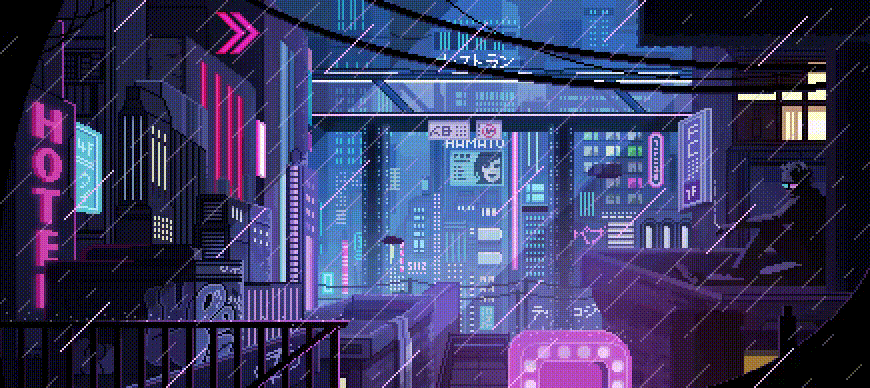

### Hello 👋, My name is Alexandr.

<!---
  
-->
## I'm a Software Developer

### 📫 How to reach me:  

[](https://github.com/KeoFoxy) [](https://twitter.com/FoxyKeo) [](https://t.me/KeoFoxy) [](https://www.linkedin.com/in/keofoxy/)

### 💻 Tech Stack:

<div style="display: grid; grid-template-columns: 1.5fr 3.5fr;">

<div>

***Mobile:***  
<div>
   
   

</div>

</div>

<div>

***Frontend:***  
  <div style="margin-left: 5px;">
     
    
    
    
  </div>
</div>


<div>

***Backend:*** 
 
<div style="margin-left: 5px;">
   
  
  
  
  
  
</div>
</div>


<!--START_SECTION:waka-->

```txt
TypeScript   14 hrs 39 mins  ████████████████████████▒   96.88 %
Other        15 mins         ▒░░░░░░░░░░░░░░░░░░░░░░░░   01.75 %
Lua          8 mins          ▒░░░░░░░░░░░░░░░░░░░░░░░░   00.90 %
Python       1 min           ░░░░░░░░░░░░░░░░░░░░░░░░░   00.20 %
C++          1 min           ░░░░░░░░░░░░░░░░░░░░░░░░░   00.18 %
```

<!--END_SECTION:waka-->

<!-- <div>

***Other***  
<div style="margin-left: 5px">
  
  
  
  
          
</div>
</div> -->

</div>
     
<!---
your comment goes here
and here


[](https://github.com/KeoFoxy)
-->

[](https://github.com/KeoFoxy)
[](https://wakatime.com/@KeoFoxy)

[](https://anilist.co/user/KeoFoxy/) 

[](https://steamcommunity.com/id/KeoFoxy/) 

[](https://github.com/KeoFoxy)   
<!--[](https://twitter.com/FoxyKeo)   -->

[](https://github.com/KeoFoxy)    


<!---

-->


<!-- 
 -->

