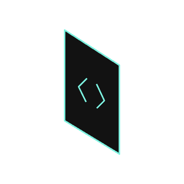

### Hello 👋, My name is Alexandr.

<!---
  
-->
## I'm a Software Developer

### 📫 How to reach me:  

[](https://github.com/KeoFoxy) [](https://twitter.com/FoxyKeo) [](https://t.me/KeoFoxy) [](https://www.linkedin.com/in/keofoxy/)

### 💻 Tech Stack:

<!-- <div>

<div>

***Mobile:***  
<div>
   
   

</div>

</div> -->

<div>
  

  

  

      
</div>


<div>
  

  

  

  <!--  -->

  

  

</div>

<!-- <div>
  

  
  
  
</div> -->

<!-- <div>

***Frontend:***  
  <div style="margin-left: 5px;">
     
    
    
    
  </div>
</div> -->


<!-- <div>

***Backend:*** 
 
<div style="margin-left: 5px;">
   
  
   
  
</div>
</div> -->


<!--START_SECTION:waka-->

```txt
TypeScript   14 hrs 56 mins  ███████████████████▒░░░░░   77.81 %
Other        3 hrs 24 mins   ████▒░░░░░░░░░░░░░░░░░░░░   17.73 %
CSS          24 mins         ▓░░░░░░░░░░░░░░░░░░░░░░░░   02.12 %
Markdown     13 mins         ▒░░░░░░░░░░░░░░░░░░░░░░░░   01.18 %
JSON         10 mins         ▒░░░░░░░░░░░░░░░░░░░░░░░░   00.91 %
```

<!--END_SECTION:waka-->

<!-- <div>

***Other***  
<div style="margin-left: 5px">
  
  
  
  
          
</div>
</div> -->

</div>
     
<!---
your comment goes here
and here


[](https://github.com/KeoFoxy)
-->

[](https://github.com/KeoFoxy)
[](https://wakatime.com/@KeoFoxy)

[](https://anilist.co/user/KeoFoxy/) 

[](https://steamcommunity.com/id/KeoFoxy/) 

[](https://github.com/KeoFoxy)   
<!--[](https://twitter.com/FoxyKeo)   -->

[](https://github.com/KeoFoxy)    


<!---

-->


<!-- 
 -->

